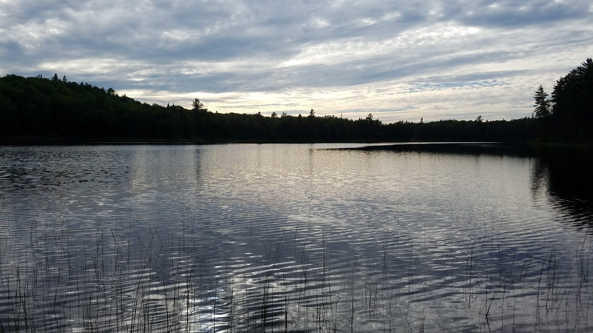

<style>
body {
    font-family: Georgia,"Times New Roman",Times,serif;
    font-size: 15px;
    line-height: 1.42857143;
    color: #000000;
    background-color: #ffffff;
}
</style>

```{r global_options, include=FALSE}
# From Internet:
#knitr::opts_chunk$set(fig.width=12, fig.height=6, echo=FALSE, warning=FALSE, message=FALSE)

```


```{r echo=FALSE, message=FALSE, warning=FALSE}
library(readr)
library(ggplot2)
library(dplyr)
library(scales)
library(DT)
library(knitr)
library(plotly)
options(scipen = 999)
```

# This document...

Explores vegetation conditions of the Michigamme Highlands ecoregion of the Upper Peninsula of Michigan to inform future conservation efforts there.  Here we:

* Provide basic graphics and interpretations of the Michigamme Highlands vegetation, past and present,
* Identify degraded lands on Northern Hardwoods sites,
* Summarize conditions of existing vegetation cover, height and type

For this assessment we clipped LANDFIRE's Biophysical Settings (BpS, represents historical ecosystems), Existing Vegetation Cover, Height and Type (EVC, EVH and EVT, ReMap version, ca 2016) to the Michigamme Highlands polygon supplied by Emily Clegg.

For more information on LANDFIRE and the datasets please visit www.landfire.gov. 

This document is a starting point, or Phase 1 of potential work in the Michigamme Highlands. It is indended to be an **introductory** look at the Michigamme Highlands and **not** an in-depth analysis of the area. Please see the Summary for potential directions this work and for contact information of the authors. 

<br>


```{r echo=FALSE, fig.cap="View from the summit of Hogback, looking across part of the Michigamme Highlands"}
knitr::include_graphics("View.jpg")
```


<br> 

# Background & Brief Definitions 

## Location and significance

The Michigamme Highlands of the central Upper Peninsula of MI are "known for containing a diverse range of habitats ... [f]orests, wetlands, lakes, rivers and rock outcroppings all connect together in a beautifully pristine area" (see more about conservation there at https://www.nature.org/en-us/get-involved/how-to-help/places-we-protect/wilderness-lakes-reserve/).  

The dynamics of land ownership in this area present ongoing opportunities for protection and ecologically focused management.

 <br>
 
```{r echo=FALSE, fig.cap="Assessment area.  Data provided by Emily Clegg."}
knitr::include_graphics("michilocator.png")
```

<br>

## What is BpS? & EVT? 

Please consult the brief definitions below before embarking onto the data visualizations. It is important to understand some key terms when analyzing the data for the MH.  

BpS = Biophysical Settings: the data essentially represents vegetation that historically dominated landscapes prior to Euro-American settlement - the ecosystems that were once in a given area based on "the current biophysical environment and an approximation of the historical disturbance regime" (https://www.landfire.gov/bps.php).

EVT = Existing Vegetation Type represents "the current distribution of the terrestrial ecological systems classification" (https://www.landfire.gov/evt.php).  

**BpS = Historic, EVT = Current**. The remainder of this document will use "Historic" and "Current" or "BpS" and "EVT" to reference these data.

<br>


```{r echo=FALSE, fig.cap="McCormick Wilderness Area, Ottawa National Forest"}

```


```{r fix up da BpS group data, message=FALSE, warning=FALSE, include=FALSE}
Michi <- read.csv("michiAllClean.csv")

# Let's make that in descending order
Michi_Arr <- arrange(Michi, desc(ACRES))

BPS_GP_ACRES <- Michi %>% #Creating new dataframe with just BPS_GP_NAME and ACRES
  group_by(BPS_GP_NAME) %>% 
  summarise(ACRES = sum(ACRES))

GP_ACRES_Arr <- arrange(BPS_GP_ACRES, desc(ACRES))

# Now, to only take the top 4 rows (IE not Open H20 or Barren)
GP_ACRES_CHOP <- GP_ACRES_Arr[c(1:4),]
```

<br>

```{r eval=FALSE, include=FALSE}

# KEPT BEAUTIFUL CODE, BUT IT IS NOT RUN IN THIS VERSION, WAH WAH
GP_ACRES_Arr <- arrange(BPS_GP_ACRES, desc(ACRES))

# Now, to only take the top 4 rows (IE not Open H20 or Barren)
GP_ACRES_CHOP <- GP_ACRES_Arr[c(1:4),]

ggplot(GP_ACRES_CHOP, aes(x = reorder(BPS_GP_NAME, ACRES), y = ACRES)) + 
  geom_bar(stat = "identity", fill = "grey") +
  coord_flip() +
  ggtitle("Historical Ecosystem Groups of the MH") +
  labs(x = "", y = "Acres", colour = "black") +
  scale_y_continuous(labels = comma) +
  theme(plot.title = element_text(size = 20), 
        axis.title = element_text(size = 20), 
        panel.grid.major = element_blank(), 
        panel.grid.minor = element_blank(),
        panel.background = element_blank(), 
        axis.line = element_line(colour = "black"))
       
```


```{r fix up da EVT group data, message=FALSE, warning=FALSE, include=FALSE}
EVT_GP_ACRES <- Michi %>% #Creating new dataframe with just EVT_200_GP_NAME and ACRES
  group_by(EVT_200_GP_NAME) %>% 
  summarise(ACRES = sum(ACRES)) 

#now to arrange in desc order  
EVT_GP_Arr <- arrange(EVT_GP_ACRES, desc(ACRES))

# Trim EVT to top 10
EVT_GP_ACRES_CHOP <- EVT_GP_Arr[c(1:10),]
```

<br>

```{r eval=FALSE, message=FALSE, warning=FALSE, include=FALSE}

# KEPT BEAUTIFUL CODE, BUT IT IS NOT RUN IN THIS VERSION, WAH WAH
ggplot(EVT_GP_ACRES_CHOP, aes(x = reorder(EVT_200_GP_NAME, ACRES), y = ACRES)) + 
  geom_bar(stat = "identity", fill = "grey") +
  coord_flip() +
#hist_evt_grp <-  
  ggtitle("Current Group Ecosystems of the MH") +
  labs(x = "", y = "Acres") +
  scale_y_continuous(labels = comma) +
  theme(plot.title = element_text(size = 20), axis.title = element_text(size = 20), panel.grid.major = element_blank(), panel.grid.minor = element_blank(),
        panel.background = element_blank(), axis.line = element_line(colour = "black"))
#ggplotly(hist_evt_grp)
```


# Ecosystems historical and current


## Historical Ecosystems
Historically, hardwoods made up a significant portion (59.6%) of the Michigamme Highlands, with Laurentian-Acadian Northern Hardwoods, Northern Hardwoods - Hemlock, and Pine-Hemlock-Hardwood forest being the top three BpSs. 

Any BpS <2% of the total acreage was omitted from the following graph (>96% was kept and is represented).

```{r fix up da BpS name data, echo=FALSE, message=FALSE, warning=FALSE}

# GRAPHING EVT AND BPS NAME INSTEAD OF GROUP NAME
# Let's start with BPS
BPS_NAME <- Michi %>% #Creating new dataframe with just BPS_NAME and ACRES
  group_by(BPS_NAME) %>% 
  summarise(ACRES = sum(ACRES))


# And the descenidng order:
BPS_NAME_Desc <- arrange(BPS_NAME, desc(ACRES))


# Top 11 (10 and 11 look equal so putting at 11 for now)
BPS_NAME_CHOP <- BPS_NAME_Desc[c(1:9),]

```

<br>

```{r echo=FALSE, message=FALSE, warning=FALSE, fig.width=12}
ggplot(BPS_NAME_CHOP, aes(x = reorder(BPS_NAME, ACRES), y = ACRES)) + 
  geom_bar(stat = "identity", fill = "red3") +
  coord_flip() +
  labs(title = "Top 9 Historical Ecosystems of the Michigamme Highlands", 
       subtitle = "Note: Area dominated by northern hardwoods types", 
       caption = "Source: LANDFIRE Biophysical Settings", 
       x = "", y = "Acres") +
  scale_y_continuous(labels = comma) +
  theme(plot.title = element_text(size = 20), 
        axis.title = element_text(size = 20), 
        panel.grid.major = element_blank(), 
        panel.grid.minor = element_blank(),
        panel.background = element_blank(), 
        axis.line = element_line(colour = "black"))

```

<br>

## 
There are 75 Existing Vegetation Types mapped in the Michigamme Highlands. However, all ecosystems beyond the top 9 comprise less than 2% each of the MH, so have been omitted from the graph (>86% was kept and is represented). 

```{r fix up da EVT name data, message=FALSE, warning=FALSE, include=FALSE}
EVT_200_NAME <- Michi %>% #Creating new dataframe with just EVT_200_NAME and ACRES
  group_by(EVT_200_NAME) %>% 
  summarise(ACRES = sum(ACRES))

# And the descenidng order:
EVT_200_NAME_Desc <- arrange(EVT_200_NAME, desc(ACRES))

# Removing Open Water:
EVT_200_NAME_Desc <- EVT_200_NAME_Desc[-c(7), ] #7 is name of row "Open Water"

# Adding % Column:
EVT_200_NAME_Desc = mutate(EVT_200_NAME_Desc,
                           EVT_Pct = (ACRES / sum(ACRES)) *100)

# Let's make it top 12 (?) Seems somewhat arbitrary but at a dropoff point
EVT_NAME_CHOP <- EVT_200_NAME_Desc[c(1:9),]

```


<br>

```{r echo=FALSE, message=FALSE, warning=FALSE, fig.width=12}
ggplot(EVT_NAME_CHOP, aes(x = reorder(EVT_200_NAME, ACRES), y = ACRES)) + 
  geom_bar(stat = "identity", fill = "darkorange1") +
  coord_flip() +
  labs(title = "Top 9 Current Ecosystems of the Michigamme Highlands", 
       subtitle = "Note: Area still dominated by northern hardwoods types", 
       caption = "Source: LANDFIRE Existing Vegatation Types of 2016", 
       x = "", y = "Acres") +
  scale_y_continuous(labels = comma) +
  theme(plot.title = element_text(size = 20), axis.title = element_text(size = 20), panel.grid.major = element_blank(), panel.grid.minor = element_blank(),
        panel.background = element_blank(), axis.line = element_line(colour = "black"))
#ggplotly(hist_grp)
```

<br>

## Current & Historical Vegetation recapped:

The Laurentian-Acadian Northern Hardwoods Forest historically was and currently is the most prevalent ecosystem in the Michigamme Highlands. From there however, there are some siginificant differences in what ecosytems are present today.

Currently, there are fewer conifer & hemlock ecosystems than historically present, and there are more primary successional species such as aspen/birch ecosystems compared to historical data. Developed roads make it into the top 9 ecosystems composing 2.1% of the Michigamme Highlands. 

Peatlands compose less than 2% of the MH today, where historically they were fourth most prevalant ecosystem. 

Development, recently logged areas, mining, agriculture, and other modern-day disturbances compose less than 2% of the MH each, but are present in the MH today and were not a historical component. 

# Existing Vegetation Height & Cover

The last components of the Michigamme Highlands we will look at in this document are existing vegetation height and existing vegetation cover. These data are provided by the LANDFIRE database. 

### How to read a Heatmap

For looking at EVC & EVH, we decided to create "heatmaps". They combine color intensity and location on the x-axis to represent data. 

The more intense the color/shade in the heatmap, the more prevalant that component of the map (in this case cover or height). For example, a dark green bar for tree canopy indicates a higher occurance (percentage) of that particular percentage of canopy cover (the x-axis). 

Each ecosystem comprises "100%" of the canopy cover percentage for that specific ecosystem.  

## Existing Vegetation Cover (EVC)

<br>

```{r echo=FALSE, message=FALSE, warning=FALSE, fig.width=12,  results='hide', fig.keep='all'}
evc_evt5 <- read_csv("evc_evt5.csv", col_types = cols(percent = col_number()))


# order EVTs
evc_evt5$evt  <- factor(evc_evt5$evt, levels = c("Northern Hardwoods Forest","Alkaline Conifer-Hardwood Swamp", "Conifer Acidic Swamp and Treed Poor Fen", "Mesic Balsam Fir-Spruce Forest", "Pine-Hemlock Forest"))

evc_evt5[order(evc_evt5$evt), ]

# make lables
evt_labels <- c("Pine-Hemlock Forest (35,820ac)",
                "Mesic Balsam Fir-Spruce Forest (36,791ac)",
                "Conifer Acidic Swamp and Treed Poor Fen (44,560ac)",
                "Alkaline Conifer-Hardwood Swamp (52,118ac)", 
                "Northern Hardwoods Forest (332,434ac)")


#plot
evc_th1 <-  ggplot(evc_evt5 ,aes(x=cover_percent ,y=evt ,fill=percent))+
  geom_tile(colour="white",size=0.25)+
  scale_fill_gradient(low="white", high="darkgreen") +
  scale_x_continuous(breaks = seq(from = 0, to = 100, by = 10)) +
  labs(x="Canopy Cover (0-100%)",y="")+
  scale_y_discrete(expand=c(0,0))+

    theme_bw(base_size = 14) +
    #theme(legend.position = "none") +
    scale_y_discrete(limits = rev(unique(sort(evc_evt5$evt ))), labels= evt_labels,) +
    labs(title = "Tree canopy cover for 5 most prevalent ecosystems",
         subtitle = "",
         caption = "LANDFIRE 2016 Existing Vegetation Cover data. ") +
    labs(fill = "Percent of \nEcosystem")
  #theme options
  theme(plot.title = element_text(size = 20), axis.title = element_text(size = 20), 
    #bold font for legend text
    legend.text=element_text(face="bold"),
    #set thickness of axis ticks
    axis.ticks=element_line(size=0.4),
    #remove plot background
    plot.background=element_blank(),
    #remove plot border
    panel.border=element_blank())+
    theme(plot.caption = element_text(hjust = 0, face= "italic"), #Default is hjust=1
          plot.title.position = "plot", #NEW parameter. Apply for subtitle too.
          plot.caption.position =  "plot")

evc_th1

```

<br>


Upon looking at EVC, you can see that Northern Hardwoods Forests have a higher percentage of canopy cover compared to the other ecosystems present. Conifer Acidic swamp and Treed Poor Fens have the lowest percentage of canopy cover.  

Most of the ecosystems' "average" canopy cover is in the middle of their percentage range, while Northern Hardwoods tend towards the upper end of their percentage range, the majority of the ecosystem has roughly 80-90% canopy cover. 


## Existing Vegetation Height (EVH)

```{r echo=FALSE, message=FALSE, warning=FALSE, fig.width=12 ,results='hide', fig.keep='all'}
evh_evt5 <- read_csv("evh_evt5.csv", col_types = cols(percent = col_number()))

evh_evt5$evt  <- factor(evh_evt5$evt, levels = c("Northern Hardwoods Forest","Alkaline Conifer-Hardwood Swamp", "Conifer Acidic Swamp and Treed Poor Fen", "Mesic Balsam Fir-Spruce Forest", "Pine-Hemlock-Hardwood Forest"))

evh_evt5[order(evh_evt5$evt), ]

# make lables
evh_labels <- c("Pine-Hemlock Forest (35,820ac)",
                "Mesic Balsam Fir-Spruce Forest (36,791ac)",
                "Conifer Acidic Swamp and Treed Poor Fen (44,560ac)",
                "Alkaline Conifer-Hardwood Swamp (52,118ac)", 
                "Northern Hardwoods Forest (332,434ac)")

```

<br>

```{r echo=FALSE, message=FALSE, warning=FALSE, fig.width=12,results='hide', fig.keep='all'}
#plot
evh_th1 <- ggplot(evh_evt5 ,aes(x=height ,y=evt ,fill=percent))+

  geom_tile(colour="white",size=0.25)+
 
  scale_fill_gradient(low="white", high="purple4") +
  scale_x_continuous(breaks = seq(from = 0, to = 100, by = 10)) +
  labs(x="Canopy Height (Meters)",y="")+
  scale_y_discrete(expand=c(0,0))+
 
  theme_bw(base_size = 14) +
  #theme(legend.position = "none") +
  scale_y_discrete(limits = rev(unique(sort(evh_evt5$evt ))), labels= evt_labels,) +
  labs(title = "Tree canopy height for 5 most prevalent ecosystems",
       subtitle = "",
       caption = "LANDFIRE 2016 Existing Vegetation Height data. ") +
  labs(fill = "Percent of \nEcosystem")
#theme options
theme(plot.title = element_text(size = 20), axis.title = element_text(size = 20), 
  #bold font for legend text
  legend.text=element_text(face="bold"),
  #set thickness of axis ticks
  axis.ticks=element_line(size=0.4),
  #remove plot background
  plot.background=element_blank(),
  #remove plot border
  panel.border=element_blank())+
  theme(plot.caption = element_text(hjust = 0, face= "italic"), #Default is hjust=1
        plot.title.position = "plot", #NEW parameter. Apply for subtitle too.
        plot.caption.position =  "plot")

evh_th1
```

<br>

Upon looking at EVH, Northern Hardwoods have the tallest canopy, and Conifer Acidic Swamp and Treed Poor Fen have the shortest - which seems reasonable given the life histories of these trees, plants, and ecosystems.  

Looking further, Pine-Hemlock Forests have a distinct 25% of their canopy around 18-19 meters, while the rest of the ecosystems tend to have most of their canopy height in the center of their range. 

Now that we have a general idea of the ecosystems present & existing vegetation height/cover of the Michigamme Highlands, let's look at ecosystems/areas that have been degraded. 

# Degraded lands

The Michigamme Highlands, while relatively undeveloped and remote, has been heavily managed by forest products producers for decades. In particular, the northern hardwoods forest type has been converted to plantations (both native and introduced tree species), simplified, or had non-maple species largely removed and harvested in a way that has left canopy closure unnaturally low.  

To assess the levels of these types of degradation we:

1.  Combined LANDFIRE Biophysical Settings and Existing Vegetation Cover, Height and Type datasets in ArcGIS
2.  Filtered and labeled the following scenarios in Excel:
    * Natural-Other ecosystem type for situations where northern hardwood sites (as mapped in the BpS dataset) were mapped as a different type in the EVT dataset
    * Northern Hardwoods > 70% canopy closure
    * Northern Hardwoods < 70% canopy closure
    * Unnatural-Converted for areas mapped as agricultural and urban in the EVT dataset
    * Plantations.  We could not distinguish between native and introduced tree species
3. Summarized to those labels by acres for the chart
4. Joined tabular data to the combined data by value to generate the map. 

<br>

```{r echo=FALSE, message=FALSE, warning=FALSE, fig.width=12}

degraded <- read_csv("degraded.csv")

degradedChart <-
ggplot(degraded, aes(x = reorder(label, percent), y = percent)) + 
  geom_bar(stat = "identity", fill = "aquamarine4") +
  coord_flip() +
  labs(title = "Levels of degredation of northern hardwood sites", 
       subtitle = "~55% of these sites in lowest degredation level", 
       caption = "Source: LANDFIRE Biophysical Settings, Existing Vegetation Cover and Type (2016)", 
       x = "", y = "Percent") +
  scale_y_continuous(labels = comma, limits = c(0, 60)) +
  theme(plot.title = element_text(size = 20), axis.title = element_text(size = 20), panel.grid.major = element_blank(), panel.grid.minor = element_blank(),
        panel.background = element_blank(), axis.line = element_line(colour = "black")) 
  

degradedChart
```

Roughly 72% of the northern hardwood sites are still mapped as northern hardwood sites, but ~30% (~17% of analysis area) of those areas have canopy cover of less than 70% suggesting.  Around 5% (over 16k acres) of the northern hardwood sites were mapped as plantation.

<br>

```{r echo=FALSE, fig.cap="Map of degredation levels of northern hardwood sites"}
knitr::include_graphics("michiDegraded2.jpg")
```

<br>

Northern hardwoods with less than 70% canopy closure are mostly in the southwestern region of the Michigamme Highlands, with plantations being spread throughout the area.

# Conclusions

This report is a primary step to introduce the current and historical state of the Michigamme Highlands Ecoregion, an ecologial area of 5,000+ acres that TNC MI is looking to put protection efforts in. 

The Michigamme Highlands are diverse with varying ecosystem types throughout. There are areas that have been degraded, and areas that remain intact with healthy and diverse landscapes. 


# Next Steps:
As previously stated, this document serves as a stepping stone toward further projects regarding the Michigamme Highlands. This report and the data utilized has many more potential uses that could further the work of protecting the Michigamme Highlands. The following are just a few ideas of steps that could be taken next.

1) More in-depth drafts of this document including interactive graphs, a different interface, etc.
2) A closer look at more specific areas of interest within the Michigamme Highlands.
3) Other data visualizations to explore the large amount of data utilized.
4) Many, many more things! Ask and we would be happy to see if we can make it happen. 


If you have any comments/questions, please feel free to reach out to Randy Swaty or Laura Slavsky (rswaty@tnc.org, laura.slavsky@tnc.org).

## Acknowledgements: 

Thanks to Emily Clegg for providing polygons of the Michigamme Highlands and to Seth Meyers for reviewing and suggesting edits to drafts of this report. 


