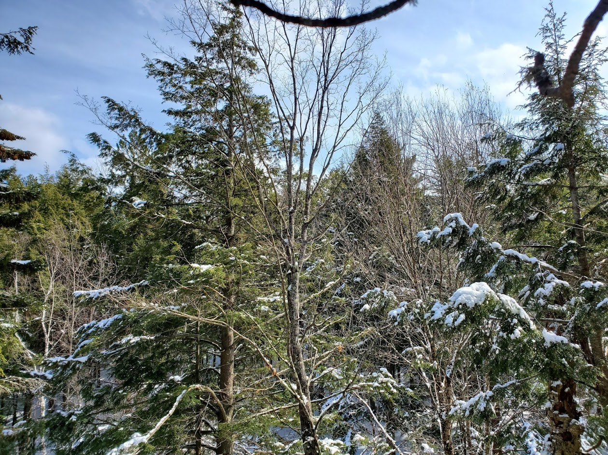
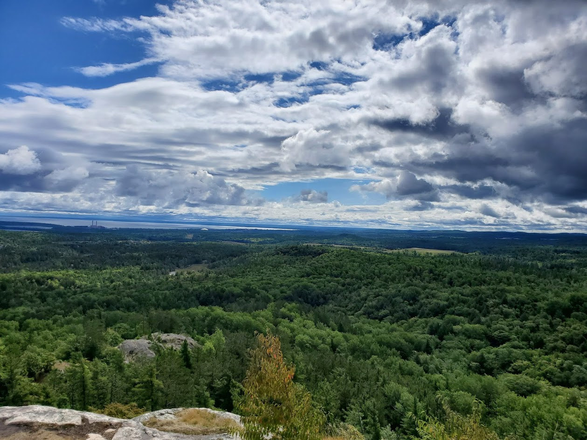

<style>
body {
    font-family: Georgia,"Times New Roman",Times,serif;
    font-size: 15px;
    line-height: 1.42857143;
    color: #000000;
    background-color: #ffffff;
}
</style>


```{r knittingOptions, message=FALSE, warning=FALSE, include=FALSE}
knitr::opts_chunk$set(echo = FALSE, message = FALSE, warning = FALSE)
```


```{r echo=FALSE}
library(readr)
library(ggplot2)
library(dplyr)
library(scales)
library(DT)
library(knitr)
library(prettydoc)
```

# Michigamme Highlands Ecosystem Exploration

```{r echo=FALSE}

```

## Questions for Exploration:
#### The main quesiton being explored in this document is: **How much of the Michigamme Highlands (MH) is in good versus bad condition?** The Data explored, provided by Randy Swaty, include over 90,000 rows and were formed by combining:
* LANDFIRE ReMap (version 200), Existing Vegetation Cover, Height and Type (evc, evh and evt)
* LANDFIRE 2012 (version 130) Biophysical Settings
* Michigamme Highlands raster (converted from polygon supplied by Emily Clegg)


#### This document has the following goals:

* Provide basic graphics and interpretations of the Michigamme Highlands by:
+ Comparing past and present acres per ecosystem
+ Identifying degraded lands
+ Summarizing conditions of existing cover, height and type
+ Other

#### This document is intended to be a start for looking into the Michigamme Highlands, and upon further inspection/analysis can be used to delve further into new questions or edited to information pertinent to those who need it. 

#### This dataset is best for looking at the big picture, and not at specific geographic areas - that can be done with map data. Happy Reading! 


```{r echo=FALSE}

```


## Background & Brief Definitions: What is BPS? & EVT? What's the difference between Group Names & Names?

#### It is important to understand some key terms when analyzing the data for the Michigamme Highlands. Please consult the brief definitions below before embarking onto the data visualizations. 

## BPS = Biophysical Settings - Historic
#### BPS stands for Biophysical Settings. BPS data is what vegetation historically dominated landscapes prior to Euro-American settlement - the ecosystems that were once in a given area. This is estimated accoridng to LANDFIRE.GOV by "the current biophysical environment and an approximation of the historical disturbance regime".

## EVT = Existing Vegetation Type - Current
#### EVT stands for Existing Vegetation Type and includes "the current distribution of the terrestrial ecological systems classification" (LANDFIRE). EVT data is from 2016 and represents current ecosystems. 

## So a quick recap: **BPS = Historic, EVT = Current**

### Group Names and Names:
#### The data include both "Group Names" and "Names". "Names" have more specified ecosystem types such as:
* "Laurentian Jack Pine-Red Pine Forest"  
* "Laurentian-Acadian Sub-boreal Mesic Balsam Fir-Spruce Forest"
* "Northeastern North American Temperate Forest Plantation"
* Etc.

This means, for example, that two groups that are both Hardwoods may have different names given to them, making looking at the bigger picture of ecosystem types and change over time difficult. 

#### Therefore, "Group Names" are also assigned to the data, allowing larger-scale comparisons of all "Hardwoods", "Conifer", "Riparian", etc. This allows for more effective data visualization of the Michigamme Highlands. 

## Quick recap: **Group Names = Overall Ecosystem Type, Names = Specified Ecosystem**

```{r echo=FALSE}
knitr::include_graphics("McCormickWilderness.jpg")
```


### The remainder of this document contains different data visualizations using the data from both BPS and EVT ecosystems. Descriptions are provided to give context and interpretation of each graph. 


# Graphs and Interpretation of the Michigamme Highlands:

### First, let's start with looking how **group ecosystems** have changed over time.

#### Using BPS data, the four most common ecosystems (Group Names) in the MH were: 
* Hardwood
* Riparian
* Conifer 
* Hardwood-Conifer 

#### Hardwoods occupied just under half, 47.9%, of the area. (Open Water was removed from the groups and Barren-Rock/Sand/Clay which occupied half of one percent of the historic area). 

```{r fix up da BpS group data}
Michi <- read.csv("michiAllClean.csv")

# Let's make that in descending order
Michi_Arr <- arrange(Michi, desc(ACRES))

BPS_GP_ACRES <- Michi %>% #Creating new dataframe with just BPS_GP_NAME and ACRES
  group_by(BPS_GP_NAME) %>% 
  summarise(ACRES = sum(ACRES))


GP_ACRES_Arr <- arrange(BPS_GP_ACRES, desc(ACRES))

# Now, to only take the top 4 rows (IE not Open H20 or Barren)
GP_ACRES_CHOP <- GP_ACRES_Arr[c(1:4),]

```


```{r echo=FALSE}
GP_ACRES_Arr <- arrange(BPS_GP_ACRES, desc(ACRES))

# Now, to only take the top 4 rows (IE not Open H20 or Barren)
GP_ACRES_CHOP <- GP_ACRES_Arr[c(1:4),]

ggplot(GP_ACRES_CHOP, aes(x = reorder(BPS_GP_NAME, ACRES), y = ACRES)) + 
  geom_bar(stat = "identity", fill = "grey") +
  coord_flip() +

  ggtitle("Historical Group Ecosystems of the Michigamme Highlands") +
  labs(x = "", y = "Acres") +
  scale_y_continuous(labels = comma) +
theme(panel.grid.major = element_blank(), panel.grid.minor = element_blank())
        #panel.background = element_blank(), axis.line = element_line(colour = "black"))
```


#### Next, looking at the current (EVT) Group Names of the Michigamme Highlands:

### There are several more ecosystems currently represented in the Michigamme Highlands compared to the BPS data, even at the group level. The majority of the MH are still hardwood, represented by the "Yellow Birch-Sugar Maple Forest" with over 330,000 acres (44%) in this group. 

### Any ecosystem <2% of the total acreage was omitted from the following graph. 

Compared to total acres, there is a relatively small percentage (5.3%) of developed land, and minimal (0.08%) Agriculture. 


```{r fix up da EVT group data}
EVT_GP_ACRES <- Michi %>% #Creating new dataframe with just EVT_200_GP_NAME and ACRES
  group_by(EVT_200_GP_NAME) %>% 
  summarise(ACRES = sum(ACRES)) 

    
#now to arrange in desc order  
EVT_GP_Arr <- arrange(EVT_GP_ACRES, desc(ACRES))

# Trim EVT to top 10
EVT_GP_ACRES_CHOP <- EVT_GP_Arr[c(1:10),]


```


```{r echo=FALSE}
ggplot(EVT_GP_ACRES_CHOP, aes(x = reorder(EVT_200_GP_NAME, ACRES), y = ACRES)) + 
  geom_bar(stat = "identity", fill = "grey") +
  coord_flip() +
  
  ggtitle("Current Group Ecosystems of the Michigamme Highlands") +
  labs(x = "", y = "Acres") +
  scale_y_continuous(labels = comma) +
  theme(panel.grid.major = element_blank(), panel.grid.minor = element_blank(),
        panel.background = element_blank(), axis.line = element_line(colour = "black"))
```


## Primary Conclusions of Group Ecosystems (Historic and Present) of the Michigamme Highlands:
* Hardwoods compose a significant acreage of the area
* There are few (<2% each) degraded areas such as plantations, agriculture, strip-mining, etc.
* Though there is not much degredation, development is the 5th most common ecosystem type in the MH


### Now, let's focus in on more specific **ecosystem names** historically and currently in the MH.

### 

```{r fix up da BpS name data}

# GRAPHING EVT AND BPS NAME INSTEAD OF GROUP NAME
# Let's start with BPS
BPS_NAME <- Michi %>% #Creating new dataframe with just BPS_NAME and ACRES
  group_by(BPS_NAME) %>% 
  summarise(ACRES = sum(ACRES))


# And the descenidng order:
BPS_NAME_Desc <- arrange(BPS_NAME, desc(ACRES))


# Top 11 (10 and 11 look equal so putting at 11 for now)
BPS_NAME_CHOP <- BPS_NAME_Desc[c(1:11),]

```

```{r echo=FALSE}
ggplot(BPS_NAME_CHOP, aes(x = reorder(BPS_NAME, ACRES), y = ACRES)) + 
  geom_bar(stat = "identity", fill = "grey") +
  coord_flip() +
  
  ggtitle("Historical Ecosystem Names") +
  labs(x = "", y = "Acres") +
  scale_y_continuous(labels = comma) +
  theme(panel.grid.major = element_blank(), panel.grid.minor = element_blank(),
        panel.background = element_blank(), axis.line = element_line(colour = "black"))
```
(Again change to cutoff at <5%?)


```{r fix up da EVT name data}
EVT_200_NAME <- Michi %>% #Creating new dataframe with just EVT_200_NAME and ACRES
  group_by(EVT_200_NAME) %>% 
  summarise(ACRES = sum(ACRES))


# And the descenidng order:
EVT_200_NAME_Desc <- arrange(EVT_200_NAME, desc(ACRES))


# AHH! Too many to see! Let's narrow to 35 and see what we get. Might need to do more than that.
EVT_35 <- EVT_200_NAME_Desc[c(1:35),]


# Let's make it top 12 (?) Seems somewhat arbitrary but at a dropoff point
EVT_NAME_CHOP <- EVT_35[c(1:12),]

```


```{r echo=FALSE}
ggplot(EVT_NAME_CHOP, aes(x = reorder(EVT_200_NAME, ACRES), y = ACRES)) + 
  geom_bar(stat = "identity", fill = "grey") +
  coord_flip() +
  
  ggtitle("Top 12 EVT Names") +
  labs(x = "", y = "Acres") +
  scale_y_continuous(labels = comma) +
  theme(panel.grid.major = element_blank(), panel.grid.minor = element_blank(),
        panel.background = element_blank(), axis.line = element_line(colour = "black"))
```


